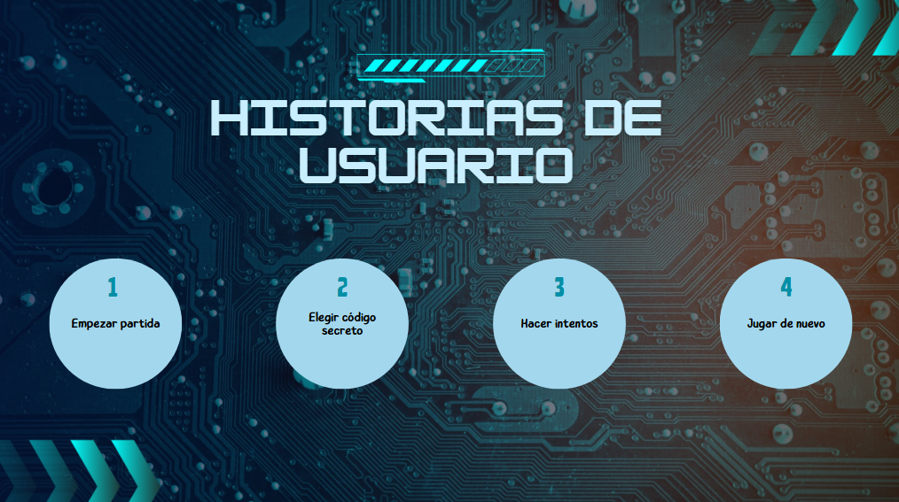
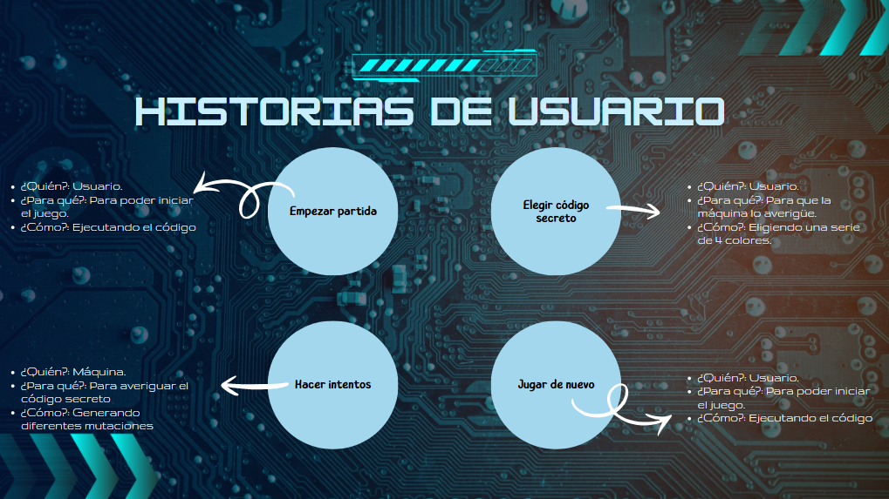
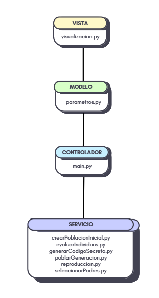
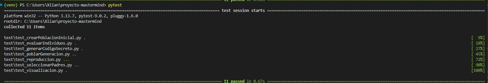
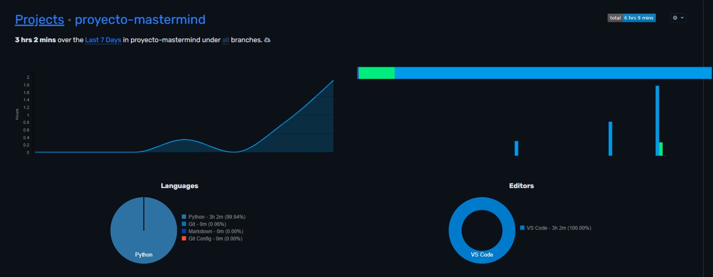

# Tabla de contenido

- [**Introducción**](#introducción)
- [**Manual**](#manual)
    - [**Instalación**](#instalación)
- [**Metodología**](#metodología)
- [**Descripción técnica**](#descripción-técnica)
    - [**Historias de usuario**](#historias-de-usuario)
    - [**Arquitectura de la aplicación**](#arquitectura-de-la-aplicación)
-  [**Diseño**](#diseño)
    - [**Diagrama de Componentes**](#diagrama-de-componentes)
- [**Implementación**](#implementación)
    - [**Tecnologías y Herramientas utilizadas**](#tecnologías-y-herramientas-utilizadas)
    - [**Backend**](#backend)
    - [**Frontend**](#frontend)
- [**Pruebas**](#pruebas)
    - [**Test de unidad**](#test-de-unidad)
    - [**Test de integración**](#test-de-integridad)
- [**Análisis del tiempo invertido**](#análisis-del-tiempo-invertido)
    - [**Wakatime**](#wakatime)
    - [**Justificación temporal**](#justificación-temporal)
- [**Uso de la IA**](#uso-de-la-ia)
- [**Conlusión**](#conclusión)
    - [**Posibles mejoras**](#posibles-mejoras)
    - [**Dificultades**](#dificultades)

# Introducción
Érika Sousa - [Érika](https://github.com/erikadocus-web)  
Xian Gomez - [Xian](https://github.com/XianGomez)

Somos alumnos de Desarrollo de Aplicaciones Multiplataforma en el IES de Teis.  
Este proyecto se ha realizado como una muestra de nuestro aprendizaje de dos meses y medio de python, markdown y git.

# Metodología
El tipo de metodología usado en este proyecto ha sido una mezcla de desarrollo en ***Espiral***.
Hemos empezado desarrollando el proyecto con el modelo en ***Espiral***. Este método lo hemos usado para realizar todas las historias de usuario hasta llegar a un prototipo.

Por último, hemos usado ***Scrum*** como marco de trabajo durante todo el proyecto.

# Descripción técnica

## Historias de usuario
  

## Arquitectura de la aplicación

La arquitectura que se ha utilizado para este proyecto es el de MVC más servicios.  
 - En el **modelo** nos encontramos con los parametros a seguir.
 - En la **vista** nos encontramos con lo que el usuario ve en su navegador.
 - En el **controlador** coordina las acciones entre la vista y el modelo.
 - En el **servicio** contiene funciones o clases que encapsulan lógica de negocio.

# Diseño

## Diagrama de Componentes

# Implementación
## Tecnologías y Herramientas utilizadas

- [Python](https://docs.python.org/3.12/)
- [Git](https://git-scm.com/)

## Backend

- Python

Los módulos usados para backend en nuestro proyecto son:
- Modelo
- Servicios
- Controlador

## Frontend

Los módulos usados para frontend en nuestro proyecto son:
- Vista
    - Estilos

# Pruebas
## Test de unidad

Es una técnica de prueba de software que nos permite comprobar funciones o métodos de manera individual, en nuestro caso tenemos 9 test de unidad:

## Test de integridad

No se ha implementado ningún test de integración

# Análisis del tiempo invertido

## Wakatime

### Érika

### Xian

## Justificación temporal

La duración del proyecto ha sido de unas tres semanas. En las cuales los primeros días se utilizo para la comprensión del proyecto en si, además de estudiar como organizar el proyecto.  

# Uso de la IA

1. ¿Qué herramienta de IA generativa usaste (nombre y versión)?
    - La herramienta de IA generativa usamos fue ChatGPT 4-o o Copilot
2. ¿Qué tipos de prompts proporcionaste?
    - Cuando nos encontrabamos con un bug que no eramos capaces de resolver, se le pedía ayuda para entender cual era el problema.
3. ¿Para qué usaste la herramienta?
    - Para explicación de documentación
    - Añadir los casos test
    - Añadir visualizacion.py
    - Bugs incapaces de dar solución después de horas de intento
4. ¿Cómo has utilizado o cambiado la salida de la IA generativa?
    - En los demás casos las soluciones que nos podia ofrecer ChatGPT no eran validas a nuestro proyecto, pero nos daba pistas por donde podemos tirar y nos daba ejemplos.

# Conclusión

En este proyecto hemos puesto en práctica los conocimientos adquiridos durante los primeros 2 meses y medio enseñados en las clases de programación y entornos de desarrollo.

## Posibles mejoras

Añadir una opción en la que juegue el usuario y que el código secreto lo seleccionara la máquina.

Se puede también hacer mejoras tanto visuales.

## Dificultades

Las dificultades que tuvimos fue principalmente encontrar el enfoque del proyecto y tener una visión de lo que teniamos que hacer.
